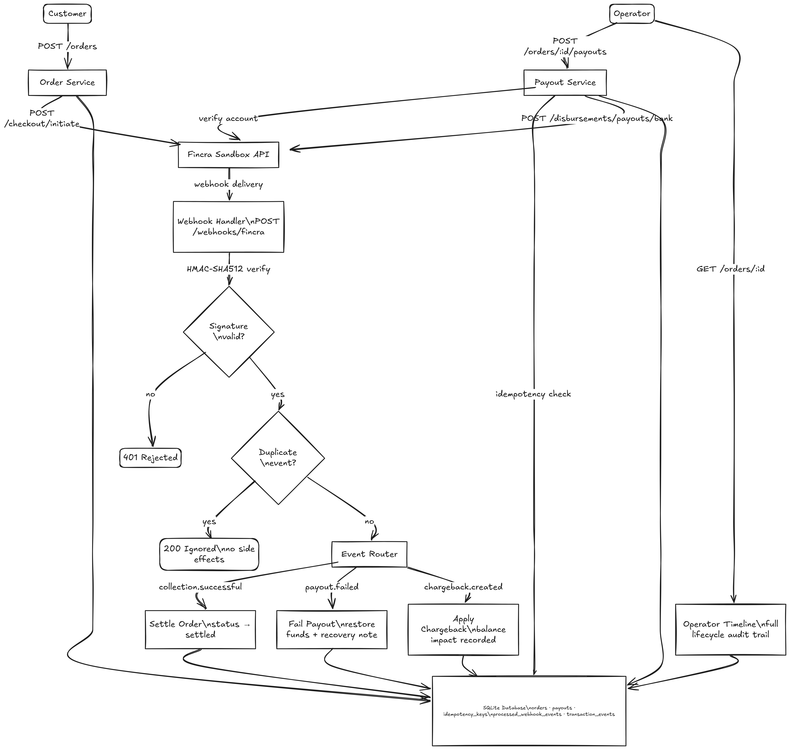

# AfriKart Payment Service

**Role:** Senior Product Engineer  
**Track:** Product Engineer  
**Candidate:** Aishah Mabayoje

A backend payment service built on top of the Fincra sandbox API that handles the full collection-to-payout lifecycle for AfriKart, a fictional African commerce platform. It covers webhook processing, idempotency, operator traceability, and failure recovery.

---

## Submission Checklist

| Requirement                                                 | Status | Notes                                                                                                                 |
| ----------------------------------------------------------- | ------ | --------------------------------------------------------------------------------------------------------------------- |
| Runnable from clean checkout                                | ✅     | [Setup instructions](#running-the-service)                                                                            |
| API base URL and credentials configurable                   | ✅     | [Environment variables](#environment-variables), never hardcoded                                                      |
| Role and seniority stated                                   | ✅     | Senior Product Engineer                                                                                               |
| Collection-to-payout happy path                             | ✅     | [Demo script](#demo-script)                                                                                           |
| Duplicate webhook handling                                  | ✅     | [Failure handling](#failure-handling), `INSERT OR IGNORE` on `processed_webhook_events`                               |
| Payout failure handling                                     | ✅     | [Failure handling](#failure-handling), async failure + recovery note                                                  |
| Webhook signature validation                                | ✅     | [`src/lib/webhook-verify.ts`](src/lib/webhook-verify.ts)                                                              |
| Double-submit prevention                                    | ✅     | [`src/services/payout.service.ts`](src/services/payout.service.ts), two-layer idempotency                             |
| Tests matching risk                                         | ✅     | [`tests/payment.test.ts`](tests/payment.test.ts) · [`tests/integration.test.ts`](tests/integration.test.ts), 29 tests |
| README covers data model, idempotency, retries, limitations | ✅     | [Data model](#data-model) · [Decision notes](#decision-notes) · [Known limitations](#known-limitations)               |
| Two decision notes with trade-offs                          | ✅     | [Decision notes](#decision-notes)                                                                                     |
| Demo script                                                 | ✅     | [Demo script](#demo-script)                                                                                           |
| One-command start                                           | ✅     | [Docker](#option-2-docker) · [Local](#option-1-local-recommended)                                                     |

---

## What This Service Does

AfriKart needs to collect payments from customers, get async confirmation from Fincra via webhooks, pay vendors their share of the money, and give operations teams a clear picture of what happened to any transaction.

This service handles all of that. It sits between AfriKart's business logic and the Fincra API, managing state, preventing duplicate processing, and keeping a full audit trail.

---

## Prerequisites

**For local development:**

- Node.js 22+
- Bun 1.3+ (to run the Fincra sandbox)
- npm

**For Docker:**

- Docker and Docker Compose

---

## Running the Service

### Prerequisites

**Local:**

- Node.js 22+
- npm

**Docker:**

- Docker and Docker Compose

---

### Step 1 - Get the code

```bash
git clone https://github.com/m-aishah/afrikart-app.git
cd afrikart-app
```

---

### Step 2 - Set up credentials

```bash
cp .env.example .env
```

Open `.env` and update these four values:
FINCRA_API_BASE_URL=https://your-sandbox-url
FINCRA_SECRET_KEY=your-secret-key
FINCRA_PUBLIC_KEY=your-public-key
FINCRA_WEBHOOK_SECRET=your-webhook-secret

---

### Step 3 - Run

**Option A - Docker (simplest):**

```bash
docker compose up --build
```

Service runs on `http://localhost:3000`.

**Option B - Local:**

```bash
npm install --ignore-scripts
npm run dev
```

Service runs on `http://localhost:3001`.

---

### Step 4 - Verify it is running

```bash
curl http://localhost:3000/health
```

or if running locally:

```bash
curl http://localhost:3001/health
```

Should return:

```json
{
  "status": "ok",
  "service": "afrikart-payment-service",
  "version": "1.0.0",
  "db": "ok"
}
```

---

### Running tests

```bash
npm install --ignore-scripts
npm test
```

---

## Environment Variables

| Variable                | Required | Default         | Description                                     |
| ----------------------- | -------- | --------------- | ----------------------------------------------- |
| `FINCRA_API_BASE_URL`   | **yes**  | -               | Fincra sandbox base URL                         |
| `FINCRA_SECRET_KEY`     | **yes**  | -               | Fincra secret key (`api-key` header)            |
| `FINCRA_PUBLIC_KEY`     | **yes**  | -               | Fincra public key (`x-pub-key` header)          |
| `FINCRA_WEBHOOK_SECRET` | **yes**  | -               | Used to verify `x-fincra-signature` HMAC-SHA512 |
| `PORT`                  | no       | `3001`          | HTTP port the service listens on                |
| `DATABASE_PATH`         | no       | `./afrikart.db` | SQLite database file path                       |
| `LOG_LEVEL`             | no       | `info`          | `trace` / `debug` / `info` / `warn` / `error`   |
| `NODE_ENV`              | no       | `development`   | Environment name                                |

---

## Running Tests

```bash
npm test
```

29 tests across 2 files covering:

- HMAC-SHA512 webhook signature verification
- Webhook deduplication including concurrent delivery
- Order state machine transitions
- Operator timeline ordering and content
- Idempotency key store semantics
- Payout state regression guard
- Full HTTP layer integration tests

---

## API Endpoints

| Method | Path                       | Description                                         |
| ------ | -------------------------- | --------------------------------------------------- |
| `GET`  | `/health`                  | Service and database liveness check                 |
| `POST` | `/orders`                  | Initiate a checkout, creates order and calls Fincra |
| `GET`  | `/orders/:orderId`         | Full order details + operator timeline              |
| `POST` | `/orders/:orderId/payouts` | Initiate a vendor payout for a settled order        |
| `POST` | `/webhooks/fincra`         | Receives all Fincra webhook events                  |

---

## Architecture



### Identifier Linkage

| Our field              | Fincra field        | Purpose                          |
| ---------------------- | ------------------- | -------------------------------- |
| `orders.checkout_ref`  | `payment.reference` | Join key for collection webhooks |
| `orders.payment_id`    | `payment.id`        | Fincra payment object ID         |
| `payouts.internal_ref` | `x-idempotency-key` | Our anchor for idempotency       |
| `payouts.provider_ref` | `payout.id`         | Join key for payout webhooks     |
| `payouts.customer_ref` | `customerReference` | Business-meaningful payout label |

---

## Data Model

Six tables in SQLite (WAL mode):

| Table                      | Purpose                                                                            |
| -------------------------- | ---------------------------------------------------------------------------------- |
| `orders`                   | Core order record. Status: `initiated` to `settled` to `charged_back` or `failed`  |
| `payouts`                  | Payout per order. Status: `pending` to `submitted` to `successful` or `failed`     |
| `idempotency_keys`         | Write-once dedup for payout double-submit, keyed on caller-supplied or derived key |
| `processed_webhook_events` | Write-once dedup for webhook delivery, keyed on Fincra `event.id`                  |
| `transaction_events`       | Append-only operator timeline. Every state change gets written here                |
| `chargebacks`              | Chargeback records linked to orders with amount, reason, and deadline              |

Schema: [`src/db/schema.ts`](src/db/schema.ts)

---

## Brief Questions Answered

**Which identifiers connect checkout.reference, payment.id, payout.reference, customerReference, and balance-log references?**

See the [identifier linkage table](#identifier-linkage) in the Architecture section above.

**Where exactly is idempotency enforced?**

- Webhooks: `INSERT OR IGNORE` into `processed_webhook_events` keyed on Fincra's `event.id`
- Payout creation: `idempotency_keys` table checked before calling Fincra, plus `x-idempotency-key` header passed to Fincra
- UI double-submit: same `idempotency_keys` lookup, returns cached response with `idempotent: true`

**What happens if collection succeeds but payout fails after the user has left the page?**

The `payout.failed` webhook arrives asynchronously. The handler updates payout status to `failed`, appends a timeline event with a recovery note ("Funds restored by provider. Operator should initiate re-payout or refund."), and the order stays `settled`. Support can see everything at `GET /orders/:id` without touching any logs.

**How does support reconstruct the lifecycle without reading application logs?**

`GET /orders/:id` returns the full `transaction_events` timeline in chronological order. Every state change, webhook receipt, payout submission, failure, and chargeback is there with a timestamp, actor, and structured detail.

**What changes if mobile-money payout arrives next month?**

Only the payout service needs a new recipient type field and routing to a `/disbursements/payouts/mobile` endpoint. The state machine, idempotency layer, webhook dedup, and operator timeline need zero changes since they are recipient-agnostic.

---

## Failure Handling

| Scenario                                 | How it is handled                                                                         |
| ---------------------------------------- | ----------------------------------------------------------------------------------------- |
| Duplicate webhook delivery               | `INSERT OR IGNORE` on `processed_webhook_events`, first delivery wins, duplicates ignored |
| Payout fails async (account ending in 9) | `payout.failed` webhook updates status and adds recovery note to operator timeline        |
| Slow payout (account ending in 7)        | Status stays `processing`, no unsafe retry until webhook resolves it                      |
| Payout state regression                  | Terminal states (`successful`, `failed`) are never overwritten                            |
| Provider chaos / 503                     | Exponential backoff with jitter, up to 3 retries                                          |
| Double-submit payout                     | Idempotency key table returns cached response, Fincra never called twice                  |
| Chargeback                               | Balance impact recorded, order marked `charged_back`, deadline visible in timeline        |
| FX quote expiry                          | Fincra rejects stale quotes, error surfaced immediately, never silently used              |
| Account verification failure             | Recipient verified before money moves, payout blocked with a clear error                  |

---

## Decision Notes

### Decision 1: SQLite over in-memory store

The sandbox itself uses an in-memory store. SQLite in WAL mode was chosen because the brief specifically asks about surviving process restarts. If the dedup table is in-memory, a restart means replayed webhooks get processed again. SQLite gives ACID durability with zero infrastructure and the schema is standard SQL, portable to Postgres by just swapping the driver.

**Rejected options:**

- In-memory: loses dedup state on restart
- Postgres: adds infrastructure dependency with no real benefit at this scale

### Decision 2: Two-layer idempotency

Idempotency is enforced at two layers. Our own `idempotency_keys` table is checked before calling Fincra, and we also pass `internal_ref` as `x-idempotency-key` to Fincra. This means a double-submit from the UI returns a cached response instantly. If the service crashes after calling Fincra but before saving locally, the next attempt gets the same Fincra response instead of creating a duplicate payout.

**Rejected options:**

- Trusting Fincra's idempotency alone: no local record if our DB call fails after a successful Fincra call

---

## Demo Script

### Happy path

```bash
# 1. Create order
curl -s -X POST http://localhost:3001/orders \
  -H 'Content-Type: application/json' \
  -d '{"amount":25000,"customerName":"Ada Lovelace","customerEmail":"ada@example.com"}' | jq .

# 2. Simulate customer paying (run this on the sandbox)
curl -s -X POST http://localhost:4000/simulate/collections/settle \
  -H 'Content-Type: application/json' \
  -d '{"reference":"<checkout_ref from step 1>"}' | jq .

# 3. Check order is settled and see the timeline
curl -s http://localhost:3001/orders/<orderId> | jq .

# 4. Pay the vendor
curl -s -X POST http://localhost:3001/orders/<orderId>/payouts \
  -H 'Content-Type: application/json' \
  -d '{"amount":10000,"recipientName":"Kofi Mensah","recipientAccount":"0001112223","recipientBankCode":"044"}' | jq .

# 5. Check payout.successful in timeline (after about 2 seconds)
curl -s http://localhost:3001/orders/<orderId> | jq '.data.timeline[-1]'
```

### Duplicate webhook

```bash
curl -s -X POST http://localhost:4000/simulate/webhooks/replay/<eventId> \
  -H 'api-key: sk_test_afrikart_secret' | jq .
# Service returns duplicate:true, order unchanged
```

### Async payout failure

```bash
# Pay to an account ending in 9
curl -s -X POST http://localhost:3001/orders/<orderId>/payouts \
  -H 'Content-Type: application/json' \
  -d '{"amount":5000,"recipientName":"Fatima Invalid","recipientAccount":"0000000009","recipientBankCode":"058"}' | jq .

# Check the timeline after 2 seconds, shows payout.failed with recoveryNote
curl -s http://localhost:3001/orders/<orderId> | jq '.data.timeline[-1]'
```

---

## Known Limitations

- No authentication on the API endpoints. A production service would need operator JWT or API keys.
- No job queue for polling unresolved payouts. If a webhook is never delivered, a payout stays `submitted` indefinitely.
- SQLite write throughput has a ceiling. High concurrency would need Postgres with advisory locks.
- No mobile-money rail yet. Adding it needs a new recipient type and endpoint route but nothing else changes.
- Chargeback dispute workflow is read-only. Chargebacks are recorded and shown in the timeline but status updates are not supported.

---

## Assumptions

- Payout is only allowed on settled orders. If collection fails, no payout is initiated.
- Recipient name mismatch between intent and what the bank returns is logged as a warning but does not block the payout. An operator can review the timeline.
- All amounts are in the lowest denomination of the currency (kobo for NGN).
